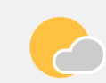
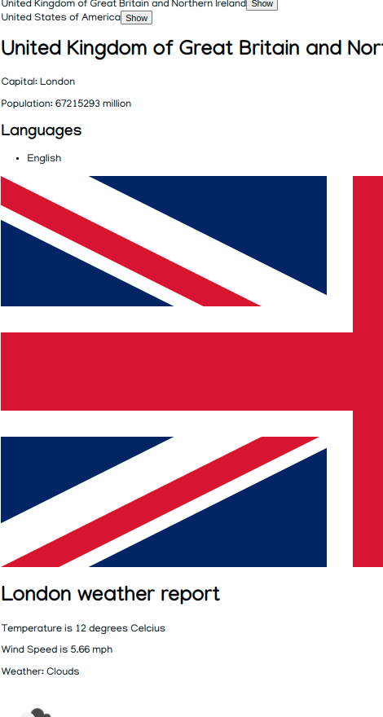

<div id="top"></div>
<!--
*** Thanks for checking out the Best-README-Template. If you have a suggestion
*** that would make this better, please fork the repo and create a pull request
*** or simply open an issue with the tag "enhancement".
*** Don't forget to give the project a star!
*** Thanks again! Now go create something AMAZING! :D
-->

<!-- PROJECT SHIELDS -->
<!--
*** I'm using markdown "reference style" links for readability.
*** Reference links are enclosed in brackets [ ] instead of parentheses ( ).
*** See the bottom of this document for the declaration of the reference variables
*** for contributors-url, forks-url, etc. This is an optional, concise syntax you may use.
*** https://www.markdownguide.org/basic-syntax/#reference-style-links
-->

[![Contributors][contributors-shield]][contributors-url]
[![Forks][forks-shield]][forks-url]
[![Stargazers][stars-shield]][stars-url]
[![Issues][issues-shield]][issues-url]
[![MIT License][license-shield]][license-url]
[![LinkedIn][linkedin-shield]][linkedin-url]

<!-- PROJECT LOGO -->
<br />
<div align="center">
  <a href="https://github.com/QualityPre/Country-Weather-App">
    
  </a>

<h3 align="center">Find Country and Weather App</h3>

  <p align="center">
    Filers through countries and displays information and also latest weather from the capital city
    <br />
    <a href="https://github.com/QualityPre/Country-Weather-App"><strong>Explore the docs »</strong></a>
    <br />
    <br />
    <a href="https://github.com/QualityPre/Country-Weather-App">View Demo</a>
    ·
    <a href="https://github.com/QualityPre/Country-Weather-App/issues">Report Bug</a>
    ·
    <a href="https://github.com/QualityPre/Country-Weather-App/issues">Request Feature</a>
  </p>
</div>

<!-- TABLE OF CONTENTS -->
<details>
  <summary>Table of Contents</summary>
  <ol>
    <li>
      <a href="#about-the-project">About The Project</a>
      <ul>
        <li><a href="#built-with">Built With</a></li>
      </ul>
    </li>
    <li>
      <a href="#getting-started">Getting Started</a>
      <ul>
        <li><a href="#prerequisites">Prerequisites</a></li>
        <li><a href="#installation">Installation</a></li>
      </ul>
    </li>
    <li><a href="#usage">Usage</a></li>
    <li><a href="#roadmap">Roadmap</a></li>
    <li><a href="#contributing">Contributing</a></li>
    <li><a href="#license">License</a></li>
    <li><a href="#contact">Contact</a></li>
    <li><a href="#acknowledgments">Acknowledgments</a></li>
  </ol>
</details>

<!-- ABOUT THE PROJECT -->

## About The Project



<p align="right">(<a href="#top">back to top</a>)</p>

### Built With

- [React.js](https://reactjs.org/)

<p align="right">(<a href="#top">back to top</a>)</p>

<!-- GETTING STARTED -->

## Getting Started

Follow these steps to get the project working locally

### Prerequisites

- npm
  ```sh
  npm install npm@latest -g
  ```

### Installation

1. Get a free API Key at [Open Weather Map](https://openweathermap.org/api)
2. Clone the repo
   ```sh
   git clone https://github.com/QualityPre/Country-Weather-App.git
   ```
3. Install NPM packages
   ```sh
   npm install
   ```
4. Make a .env file at root of the project. Enter the following:
   ```js
   REACT_APP_API_KEY = 'ENTER YOUR API key'
   ```

<p align="right">(<a href="#top">back to top</a>)</p>

<!-- USAGE EXAMPLES -->

## Usage

simply type in any country. If there is only one country it will automatically display the information for that country

<p align="right">(<a href="#top">back to top</a>)</p>

<!-- ROADMAP -->

## Roadmap

- [ ] Re-design of the site, using TailwindCSS
- [ ] Add extra country information
- [ ] Extend the app for other place
  - [ ] Show the weather

See the [open issues](https://github.com/QualityPre/Country-Weather-App/issues) for a full list of proposed features (and known issues).

<p align="right">(<a href="#top">back to top</a>)</p>

<!-- CONTRIBUTING -->

## Contributing

Contributions are what make the open source community such an amazing place to learn, inspire, and create. Any contributions you make are **greatly appreciated**.

If you have a suggestion that would make this better, please fork the repo and create a pull request. You can also simply open an issue with the tag "enhancement".
Don't forget to give the project a star! Thanks again!

1. Fork the Project
2. Create your Feature Branch (`git checkout -b feature/AmazingFeature`)
3. Commit your Changes (`git commit -m 'Add some AmazingFeature'`)
4. Push to the Branch (`git push origin feature/AmazingFeature`)
5. Open a Pull Request

<p align="right">(<a href="#top">back to top</a>)</p>

<!-- LICENSE -->

## License

Distributed under the MIT License. See `LICENSE.txt` for more information.

<p align="right">(<a href="#top">back to top</a>)</p>

<!-- CONTACT -->

## Contact

Your Name - [@quality_pre](https://twitter.com/quality_pre) - qualitypre@protonmail.com

Project Link: [https://github.com/QualityPre/Country-Weather-App](https://github.com/QualityPre/Country-Weather-App)

<p align="right">(<a href="#top">back to top</a>)</p>

<!-- ACKNOWLEDGMENTS -->

## Acknowledgments

This was an exercise from:

- [Full Stack Open](https://fullstackopen.com/)

<p align="right">(<a href="#top">back to top</a>)</p>

<!-- MARKDOWN LINKS & IMAGES -->
<!-- https://www.markdownguide.org/basic-syntax/#reference-style-links -->

[contributors-shield]: https://img.shields.io/github/contributors/QualityPre/Country-Weather-App.svg?style=for-the-badge
[contributors-url]: https://github.com/QualityPre/Country-Weather-App/graphs/contributors
[forks-shield]: https://img.shields.io/github/forks/QualityPre/Country-Weather-App.svg?style=for-the-badge
[forks-url]: https://github.com/QualityPre/Country-Weather-App/network/members
[stars-shield]: https://img.shields.io/github/stars/QualityPre/Country-Weather-App.svg?style=for-the-badge
[stars-url]: https://github.com/QualityPre/Country-Weather-App/stargazers
[issues-shield]: https://img.shields.io/github/issues/QualityPre/Country-Weather-App.svg?style=for-the-badge
[issues-url]: https://github.com/QualityPre/Country-Weather-App/issues
[license-shield]: https://img.shields.io/github/license/QualityPre/Country-Weather-App.svg?style=for-the-badge
[license-url]: https://github.com/QualityPre/Country-Weather-App/blob/master/LICENSE.txt
[linkedin-shield]: https://img.shields.io/badge/-LinkedIn-black.svg?style=for-the-badge&logo=linkedin&colorB=555
[linkedin-url]: https://linkedin.com/in/qualitypre
[product-screenshot]: images/screenshot.png
